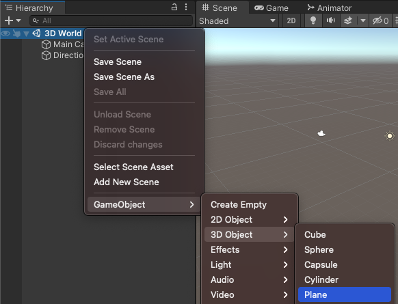

The 3D Object 'Plane' is often used as a floor or ground in Unity scenes. 

To add a plane, go to the Hierarchy window and right-click on your scene. Choose 'GameObject' -> '3D Object' -> 'Plane':

The default size for the plane is 10m x 10m. Unity uses metres as the unity of measurement. 

