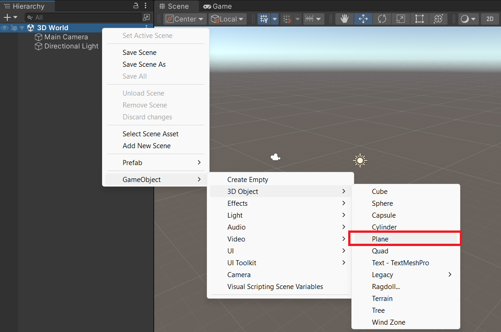

L'objet 3D « Plane » est souvent utilisé comme plancher ou sol dans les scènes Unity.

Pour ajouter un plan, va dans la fenêtre Hierarchy et fais un clic droit sur ta scène. Choisis « GameObject » -> « 3D Object » -> « Plane » :

La taille par défaut du plan est de 10 m x 10 m. Unity utilise le mètre comme unité de mesure.

